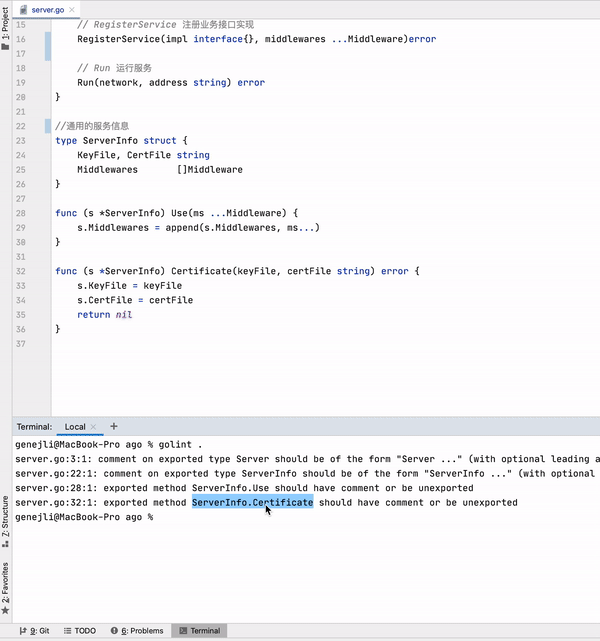
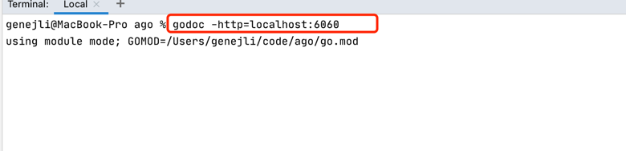
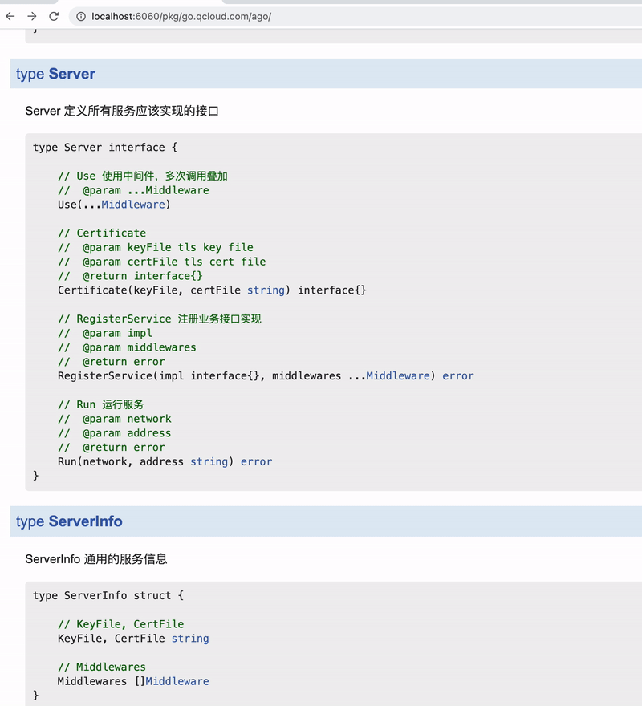

# GoComment

<!-- Plugin description -->
**GoComment** is a plugin for vscode, auto generate for golang function, variable, struct comments. It can auto fix function name etc.
使用默认模版可以生成满足golint要求的注释，可以根据函数名的相似度来纠正拼写错误或者修改的函数名，变量名，参数名等。需要注意的是当参数名之间很相似的时候，可能会获取到错误的注释。
可在vscode扩展插件中搜索 GoComment。
本仓库(https://github.com/0x00b/vscode-go-comment
)是vscode版本，对应的goland版本地址 https://github.com/0x00b/golandanno 。
<br/>

## <t1>How to use</t1>
+ **control + command + / (For windows: control + alt + /)**
   
## config template
+ 1. shift+command+p -> open setting (`json`)
+ 2. add line `"functionTemplate": "// ${func_name} \n//  @receiver ${receiver_name} \n//  @param ${param_name} \n//  @return ${return_name} "`,
+ 3. add line `"typeTemplate": "// ${type_name} "` 

<br/>
推荐使用默认注释，满足Golang godoc注释规范，满足golint默认扫描规则。<br/>



使用godoc查看注释效果如下：

```shell
godoc -http=localhost:6060
```





<!-- Plugin description end -->
 
# Getting started

## 模板说明
如果开启了保存时自动格式化代码，则对模板有一定要求。
比如下面的模板，可能在保存时会被改变：
```json
{
    "functionTemplate": "// ${func_name} \n//  @receiver ${receiver_name} \n//  @param ${param_name} \n//  @return ${return_name} \n//  @author ${git_name} \n//  @date ${date}",
}
```
原因是第一行的注释是 "// ", 后面是一个空格，后面的行的注释开头//后面是两个空格，gofmt认为第一行的注释和后面的注释风格不一样，会被gofmt主动加上tab键，导致最终格式变化。

## How to install
1.vscode plugins marketplace(search GoComment)

### special tag, represent beginning of a special line.
* @receiver ： golang function receiver
* @param ： golang function parameter 
* @return ： golang function return parameter
* @author ： author name, or use ${git_name}
* @date ： use ${date}, if not set, use current date
* @update ： update tag, maybe config as `"${git_name} ${date}"`, update `"${date}"` always

### support variable
```go
func (r receiver)Foo(i interface{}) (e error)
```
```
* ${func_name} : function name is "Foo".
* ${receiver_name} : will be replaced by "r".
* ${receiver_type} : will be replaced by "receiver".
* ${receiver_name_type} :  will be replaced by "r receiver".
* ${param_name} : "i"
* ${param_type} : "interface{}"
* ${param_name_type} : "i interface{}"
* ${return_name} : "e"
* ${return_type} : "error"
* ${return_name_type} : "e error"
* ${package_name} : package name
* ${type_name} : type Int int64,  ${type_name} is "Int"
* ${var_name} : var n int, ${var_name} is "n"
* ${var_type} : var n int, ${var_type} is "int"
* ${date} : date
* ${git_name}: git config name
```

### how to build and publish
```shell
vsce login publisher #login first, if need
vsce package
vsce publish
```
